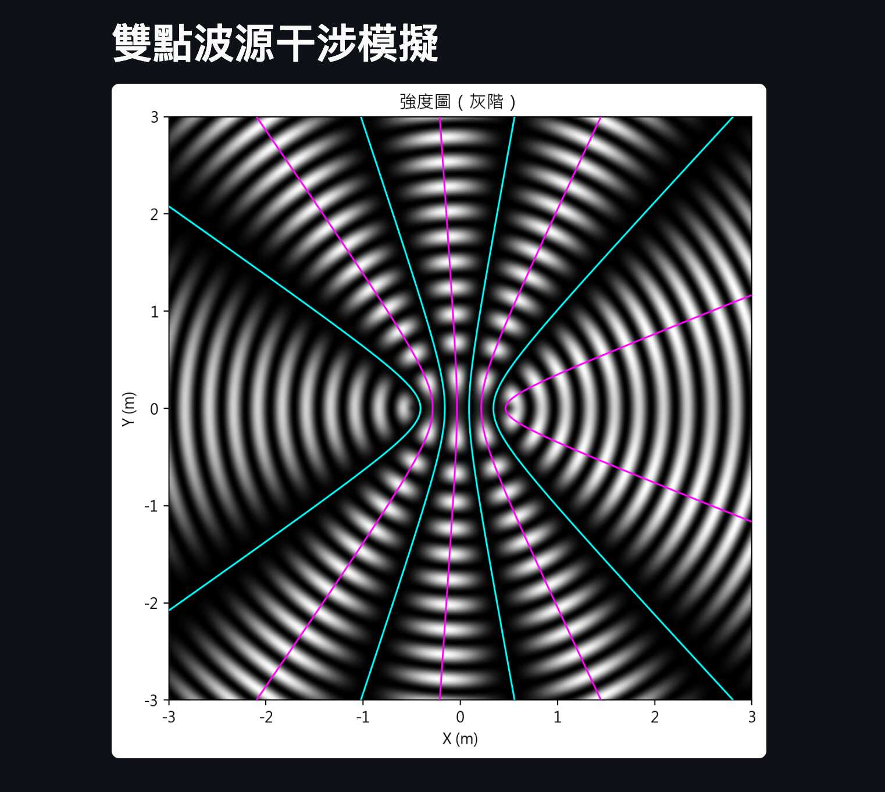

# 雙點波源干涉模擬器

這是一個使用 [Streamlit](https://streamlit.io/) 開發的互動式模擬工具，用來展示兩個點波源在 2D 空間中產生的干涉圖樣。
支援多種參數調整與可視化方式，適合用於高中或大學「波動與干涉」單元的教學與研究。

---

## 🔧 功能特色

* ✅ 可調整波長、振幅、初相位、波源距離、觀測區域大小與解析度
* ✅ 可切換「強度圖」（灰階）或「相位圖」（彩色 twilight colormap）
* ✅ 顯示干涉條紋（波節線、波腹線）
* ✅ 顯示兩波源各自的波前（波峰/波谷同心圓）
* ✅ 切換距離衰減（模擬聲波、水波等能量擴散現象）
* ✅ 支援特殊情況處理（如干涉條紋退化為半線）

---

## 📐 數學背景

設兩波源位於 $S_1$、$S_2$，任一觀測點為 $P=(x, y)$：

* 路徑差：$r_2 - r_1$，其中 $r_i = |P - S_i|$
* 相位差：

  $$
  \Delta = k(r_2 - r_1) + (\phi_2 - \phi_1)
  $$

  其中 $k = \frac{2\pi}{\lambda}$ 為波數，$\phi_1, \phi_2$ 為初相位。

### 波腹線（建設性干涉）：

$$
\Delta = 2\pi m \quad \Rightarrow \quad r_2 - r_1 = \left(m - \frac{\phi_2 - \phi_1}{2\pi} \right) \lambda
$$

為一組**雙曲線**，以兩源為焦點。

### 波節線（破壞性干涉）：

$$
\Delta = (2m+1)\pi \quad \Rightarrow \quad r_2 - r_1 = \left(m + \tfrac{1}{2} - \frac{\phi_2 - \phi_1}{2\pi} \right) \lambda
$$

同樣為一組雙曲線，與波腹線交錯排列。

### 波前（以單一波源為圓心）：

* 波峰：$r_i = \left(n - \frac{\phi_i}{2\pi}\right) \lambda$
* 波谷：$r_i = \left(n + \tfrac{1}{2} - \frac{\phi_i}{2\pi}\right) \lambda$

---

## 🎯 技術細節

* 使用 `numpy` 計算每一點的距離、相位差與合成波形
* 使用 `matplotlib.pyplot.imshow()` 顯示背景圖（強度圖或相位圖）
* 使用 `ax.contour()` 與 `ax.plot()` 畫出條紋線與等相位線
* 退化情況自動處理：

  * 若兩源同相、同振幅，且距離為波長整數倍 $d = N\lambda$
  * 則最外側的波腹線不再是雙曲線，而是從兩波源向外延伸的**半直線**

---

## 🚀 執行方式

安裝套件：

```bash
pip install streamlit numpy matplotlib
```

執行主程式：

```bash
streamlit run interference_app.py
```

---

## 📸 模擬示意圖



---

## 📁 檔案結構

```
interference_app.py  # 主程式（包含所有數學方程與繪圖邏輯）
README.md            # 使用與數學說明文件
```

---

## 🧠 延伸目標（開發中）

* 時間動畫（模擬 $\psi(x, y, t)$ 隨時間變化）
* 任意多點波源（波源排列模擬）
* 可互動地點擊觀測點，顯示數值資料
* HSV 混合強度與相位做色彩圖像
